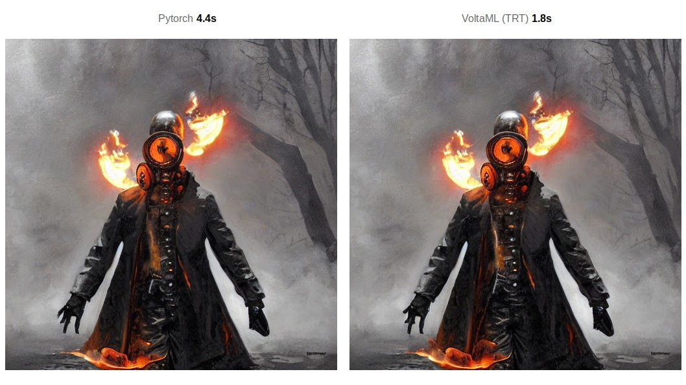
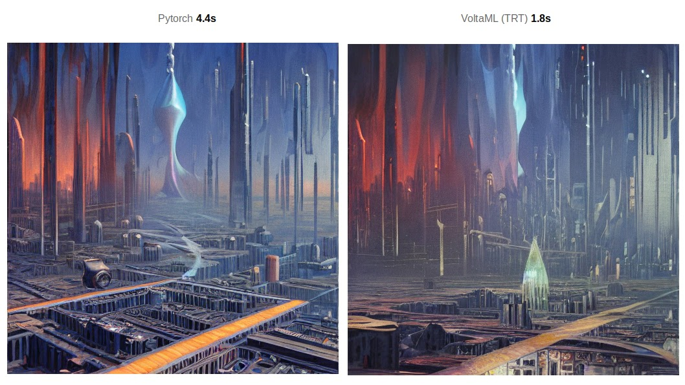

<div align="center">

  
  <h1>VoltaML - Fast Stable Diffusion</h1>
  
  <p><b>
    Stable Diffusion WebUI and API accelerated by <a href="https://developer.nvidia.com/tensorrt">TensorRT</a> 
  </b></p>
  
  
  <p>
    <a href="https://github.com/VoltaML/voltaML-fast-stable-diffusion/graphs/contributors">
      
    </a>
    <a href="">
      
    </a>
    <a href="https://github.com/VoltaML/voltaML-fast-stable-diffusion/network/members">
      
    </a>
    <a href="https://github.com/VoltaML/voltaML-fast-stable-diffusion/stargazers">
      
    </a>
    <a href="https://github.com/VoltaML/voltaML-fast-stable-diffusion/issues/">
      
    </a>
    <a href="https://github.com/VoltaML/voltaML-fast-stable-diffusion/blob/master/LICENSE">
      
    </a>
  </p>
  <a href="https://discord.gg/pY5SVyHmWm">  </a> 
    
  <h4>
      <a href="https://stax124.github.io/voltaML-fast-stable-diffusion/">Documentation</a>
    <span> · </span>
      <a href="https://github.com/VoltaML/voltaML-fast-stable-diffusion/issues/new/choose">Report Bug</a>
    <span> · </span>
      <a href="https://github.com/VoltaML/voltaML-fast-stable-diffusion/issues/new/choose">Request Feature</a>
  </h4>

</div>

<br />

<h1> Table of Contents</h1>

- [About the Project](#about-the-project)
  - [Screenshots](#screenshots)
  - [Tech Stack](#tech-stack)
  - [Features](#features)
  - [Speed comparison](#speed-comparison)
  - [Environment Variables](#environment-variables)
- [Getting Started](#getting-started)
  - [Docker setup](#docker-setup)
  - [Running locally](#running-locally)
    - [API + Compiled frontend](#api--compiled-frontend)
    - [Frontend in development mode](#frontend-in-development-mode)
- [Contributing](#contributing)
  - [Code of Conduct](#code-of-conduct)
- [License](#license)
- [Contact](#contact)

# About the Project

## Screenshots

<div align="center"> 
  
</div>

## Tech Stack

<details>
  <summary>Client</summary>
  <ul>
    <li><a href="https://www.typescriptlang.org/">Typescript</a></li>
    <li><a href="https://vuejs.org/">Vue.js</a></li>
    <li><a href="https://www.naiveui.com/en-US/dark">NaiveUI</a></li>
    <li><a href="https://ionic.io/ionicons">Ionicons</a></li>
  </ul>
</details>

<details>
  <summary>API</summary>
  <ul>
    <li><a href="https://www.python.org/">Python</a></li>
    <li><a href="https://fastapi.tiangolo.com/">FastAPI</a></li>
    <li><a href="https://pytorch.org/">PyTorch</a></li>
    <li><a href="https://developer.nvidia.com/tensorrt">TensorRT</a></li>
    <li><a href="https://github.com/facebookresearch/xformers">xFormers</a></li>
    <li><a href="https://websockets.readthedocs.io/en/stable/">WebSockets</a></li>
  </ul>
</details>

<details>
<summary>Discord Bot</summary>
  <ul>
    <li><a href="https://github.com/Rapptz/discord.py">Discord.py</a></li>
  </ul>
</details>

<details>
<summary>DevOps</summary>
  <ul>
    <li><a href="https://www.docker.com/">Docker</a></li>
    <li><a href="https://github.com/features/actions">GitHub Actions</a></li>
    <li><a href="https://pages.github.com/">GitHub Pages</a></li>
    <li><a href="https://vitepress.vuejs.org/">VitePress</a></li>
  </ul>
</details>

## Features

- Easy install with Docker
- Clean and simple Web UI
- Supports PyTorch as well as TensorRT for fastest inference
- Support for Windows and Linux (TRT is not officialy supported on Windows if running locally)
- xFormers support
- GPU cluster support with load balancing
- Discord bot

## Speed comparison

The below benchmarks have been done for generating a 512x512 image, batch size 1 for 50 iterations.

| Model                    | T4 (it/s)     | A10 (it/s) | A100 (it/s) | 4090 (it/s) | 3090 (it/s) | 2080Ti (it/s) |
| ------------------------ | ------------- | ---------- | ----------- | ----------- | ----------- | ------------- |
| PyTorch                  | 4.3           | 8.8        | 15.1        | 19          | 11          | 8             |
| Flash attention xformers | 5.5           | 15.6       | 27.5        | 28          | 15.7        | N/A           |
| AITemplate               | Not supported | 26.7       | 55          | 60          | N/A         | Not supported |
| VoltaML(TRT-Flash)       | 11.4          | 29.2       | 62.8        | 85          | 44.7        | 26.2          |





## Environment Variables

You need to export following environment variables to run this project locally:

- `HUGGINGFACE_TOKEN`
- `DISCORD_BOT_TOKEN` (only if you want to use the discord bot)

When running with docker, you need to set these environment variables in the <b style="color: greenyellow">docker-compose.yml</b> file

# Getting Started

## Docker setup

Download the <b style="color: greenyellow">docker-compose.yml</b> file (no need to clone the repository):

```
curl -O https://raw.githubusercontent.com/VoltaML/voltaML-fast-stable-diffusion/master/docker-compose.yml
```

Please open the file and <b style="color: yellow">edit the environment variables</b>.

Now you can start the container with:

```
docker-compose up -d
```

`-d` specifies that the container should run in the background. You can omit this flag if you want to see the logs and have the container stop when you press `CTRL+C`.

Linux users may need to run this command with `sudo`.

## Running locally

Clone the project

```bash
git clone https://github.com/VoltaML/voltaML-fast-stable-diffusion.git
```

Go to the project directory

```
cd voltaML-fast-stable-diffusion
```

### API + Compiled frontend

Start up the API, you might be prompted to activate the virtual environment (how will be explained in the message)

```
python main.py
```

### Frontend in development mode

Change directory to frontend

```
cd frontend
```

Install dependencies

```
yarn
```

Start the development server

```
yarn dev
```

<!-- ## 🧪 Running Tests

To run tests, run the following command

```bash
poe test
``` -->

# Contributing

<a href="https://github.com/VoltaML/voltaML-fast-stable-diffusion/graphs/contributors">
  
</a>

Contributions are always welcome!

See `contributing.md` for ways to get started.

## Code of Conduct

Please read the [Code of Conduct](https://github.com/VoltaML/voltaML-fast-stable-diffusion/blob/master/CODE_OF_CONDUCT.md)

# License

Distributed under the <b>GPL v3</b>. See LICENSE for more information.

# Contact

Feel free to contact us on discord: https://discord.gg/pY5SVyHmWm

Project Link: [https://github.com/VoltaML/voltaML-fast-stable-diffusion](https://github.com/VoltaML/voltaML-fast-stable-diffusion)
