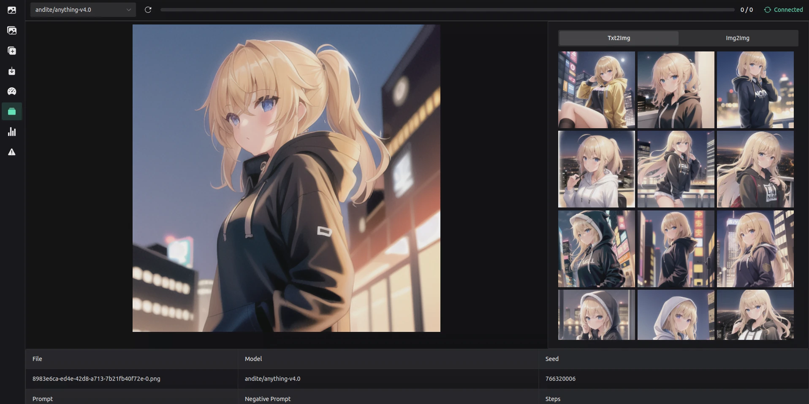

  
  <h1>VoltaML - Fast Stable Diffusion</h1>
  
  
<b>
    Stable Diffusion WebUI and API accelerated by <a href="https://github.com/facebookincubator/AITemplate">AITemplate</a> 
  </b>

  
  
  

    
    
    
    
    
    
    
    
    
    
  

   
    
  <h4>
      <a href="https://voltaml.github.io/voltaML-fast-stable-diffusion/">Documentation</a>
     · 
      <a href="https://github.com/VoltaML/voltaML-fast-stable-diffusion/issues/new/choose">Report Bug</a>
     · 
      <a href="https://github.com/VoltaML/voltaML-fast-stable-diffusion/issues/new/choose">Request Feature</a>
  </h4>

<h3 align="center">Made with ❤️ by <a href="https://github.com/Stax124/">Stax124</a></h3>

 

<h1> Table of Contents</h1>

- [About the Project](#about-the-project)
  - [Screenshots](#screenshots)
  - [Tech Stack](#tech-stack)
  - [Main features](#main-features)
  - [Speed comparison](#speed-comparison)
  - [Installation](#installation)
- [Contributing](#contributing)
  - [Code of Conduct](#code-of-conduct)
- [License](#license)
- [Contact](#contact)

# About the Project

## Screenshots

 
  
  
  

## Tech Stack

  
Client

  <ul>
    <li><a href="https://www.typescriptlang.org/">Typescript</a></li>
    <li><a href="https://vuejs.org/">Vue.js</a></li>
    <li><a href="https://www.naiveui.com/en-US/dark">NaiveUI</a></li>
    <li><a href="https://ionic.io/ionicons">Ionicons</a></li>
  </ul>

  
API

  <ul>
    <li><a href="https://www.python.org/">Python</a></li>
    <li><a href="https://fastapi.tiangolo.com/">FastAPI</a></li>
    <li><a href="https://pytorch.org/">PyTorch</a></li>
    <li><a href="https://github.com/facebookincubator/AITemplate">AITemplate</a></li>
    <li><a href="https://github.com/facebookresearch/xformers">xFormers</a></li>
    <li><a href="https://websockets.readthedocs.io/en/stable/">WebSockets</a></li>
  </ul>

Discord Bot

  <ul>
    <li><a href="https://github.com/Rapptz/discord.py">Discord.py</a></li>
  </ul>

DevOps

  <ul>
    <li><a href="https://www.docker.com/">Docker</a></li>
    <li><a href="https://github.com/features/actions">GitHub Actions</a></li>
    <li><a href="https://pages.github.com/">GitHub Pages</a></li>
    <li><a href="https://vitepress.vuejs.org/">VitePress</a></li>
  </ul>

## Main features

- Easy install with Docker
- Clean and simple Web UI
- Supports PyTorch as well as AITemplat for inference
- Support for Windows and Linux
- xFormers supported out of the box
- GPU cluster load balancing
- Discord bot
- Documented API
- Clean source code that should be easy to understand

## Speed comparison

The below benchmarks have been done for generating a 512x512 image, batch size 1 for 50 iterations.

| GPU (it/s) | T4  | A10  | A100 | 4090 | 4080 | 3090 | 2080Ti | 3050 |
| ---------- | --- | ---- | ---- | ---- | ---- | ---- | ------ | ---- |
| PyTorch    | 4.3 | 8.8  | 15.1 | 19   | 15.5 | 11   | 8      | 4.1  |
| xFormers   | 5.5 | 15.6 | 27.5 | 28   | 20.2 | 15.7 | N/A    | 5.1  |
| AITemplate | N/A | 23   | N/A  | N/A  | 40.5 | N/A  | N/A    | 10.2 |

## Installation

Please see the [documentation](https://voltaml.github.io/voltaML-fast-stable-diffusion/installation/docker.html) for installation instructions.

# Contributing

Contributions are always welcome!

See `contributing.md` for ways to get started.

## Code of Conduct

Please read the [Code of Conduct](https://github.com/VoltaML/voltaML-fast-stable-diffusion/blob/master/CODE_OF_CONDUCT.md)

# License

Distributed under the <b>GPL v3</b>. See [License](https://github.com/VoltaML/voltaML-fast-stable-diffusion/blob/experimental/License) for more information.

# Contact

Feel free to contact us on discord: https://discord.gg/pY5SVyHmWm

Project Link: [https://github.com/VoltaML/voltaML-fast-stable-diffusion](https://github.com/VoltaML/voltaML-fast-stable-diffusion)
