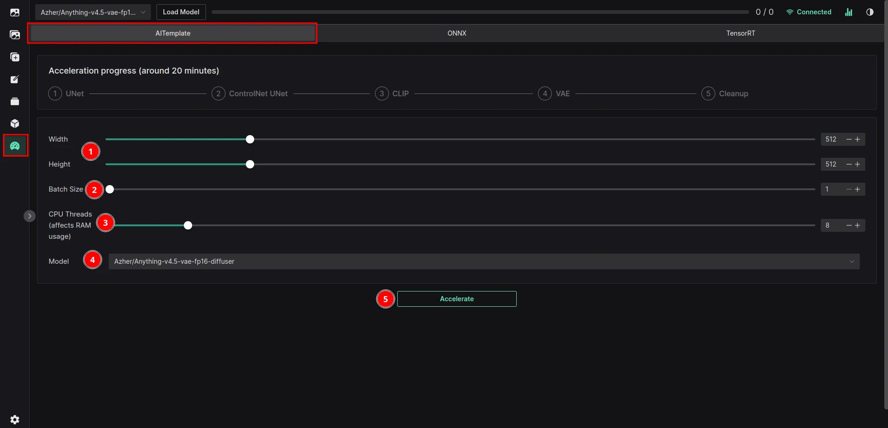
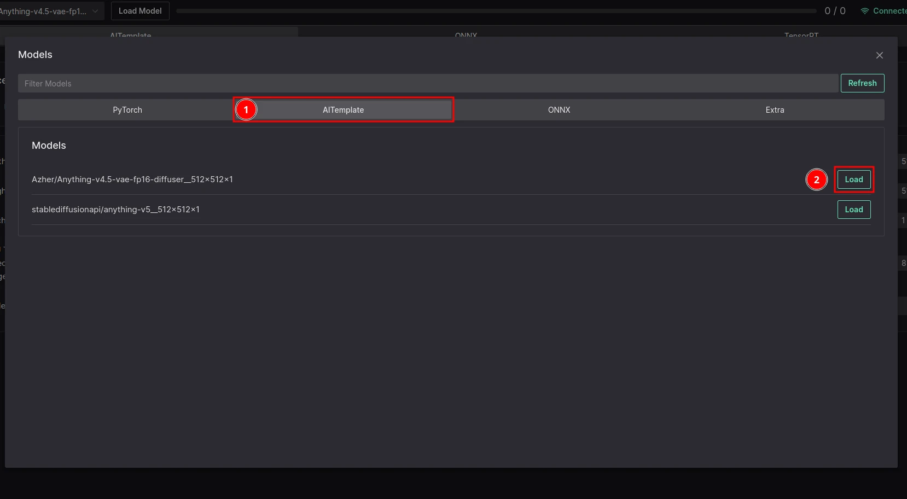

# AITemplate Acceleration

## Benefits

- About 1.7x faster generation

## Downsides

- No LoRA support
- No Textual Inversion support
- Max 64 tokens
- Locked down resolution

::: info
Some of these downsides will be fixed with the Dynamic AITemplate Acceleration
:::

## Acceleration

Make sure that you are one the correct page as can be seen in the image below.

1. Width and Height - these cannot be changed after the model is compiled
2. Batch Size - this cannot be changed after the model is compiled as well - but Batch Count can - for this reason, I recommend setting it to 1
3. CPU Threads - Number of CPU threads that will be used for compilation - **MORE THREADS, MORE RAM NEEDED** - if you do not have enough RAM, lower this number down, **6-8 Threads is recommended (about 7GB free RAM needed)**
4. Model - model that will be accelerated
5. Accelerate Button - click this to start the acceleration process

::: warning
Due to extreme load on the CPU, connection between the browser and the server may be lost. If this happens, you need to click the reconnect button - acceleration should not be affected.
:::

## How to use

1. Switch the Model tab to AITemplate
2. Click the `Load` button
3. Generate an image - only txt2img, img2img and ControlNet are supported

::: danger IMPORTANT
ControlNet is only available for the 512x512 model - we are working on a fix
:::
