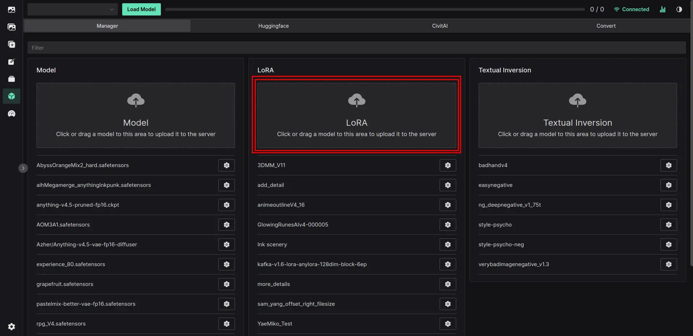
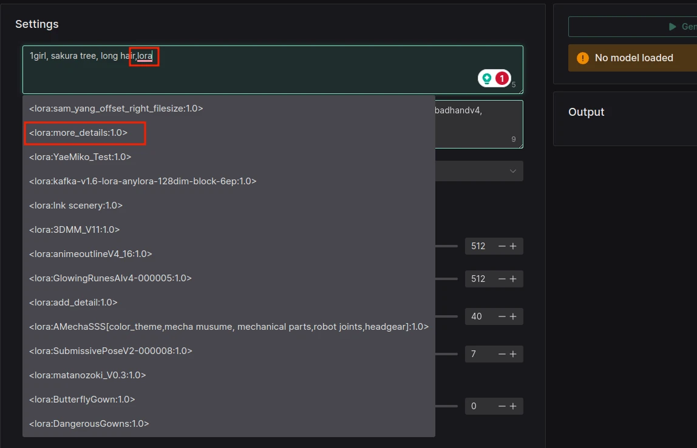

# LoRA

[Low-Rank Adaptation (LoRA)](https://arxiv.org/abs/2106.09685) is a mathematical technique developed for fine-tuning large language models (LLMs). It can also be used with Stable Diffusion.

## Benefits

- Much faster training
- Lower memory usage
- Lower file size

## Downloading

LoRAs are available to download from [Civit.ai](https://civit.ai/). You can download them from there and then upload them to Volta via the Model Manager:

## Loading

::: warning ATTENTION Experimental users
All you need to do is provide the token \<lora:xyz\> in the prompt to load and activate the LoRA. This will become the standard way of loading LoRAs when v0.3 gets released. This should work with LyCORIS as well. Autocomplete should help you with this way of using LoRAs.
:::

1. Load any model and click the `Select` button
2. Click `Load` on the LoRA model you want to use

::: tip
You can use multiple LoRA models at once.
:::

::: tip
You can also use sliders to control the strength of the LoRA. This can be specified for UNet and Text Encode separately.
:::

## Usage

You can activate the LoRA by using the provided token that you can find on it's Civit.ai page.
