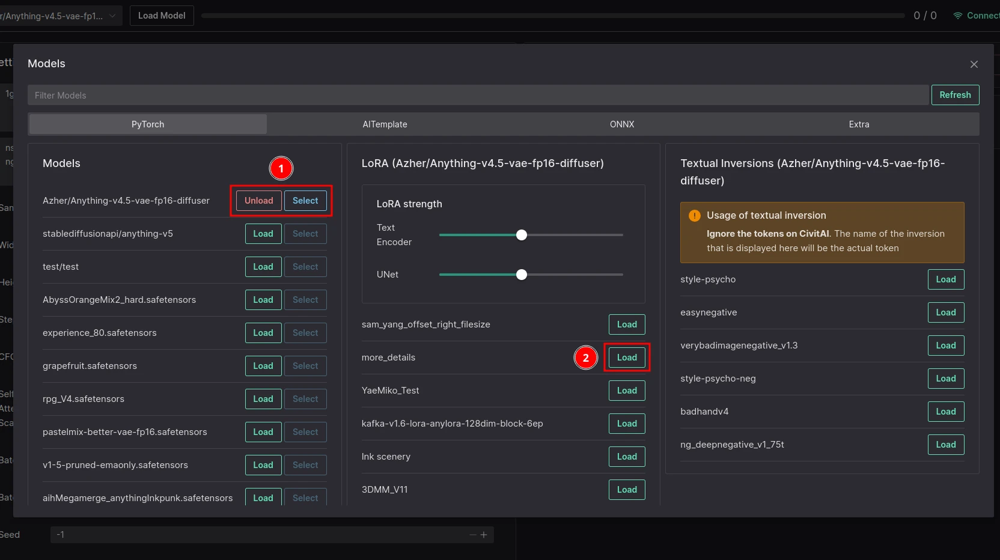

# LoRA

[Low-Rank Adaptation (LoRA)](https://arxiv.org/abs/2106.09685) is a mathematical technique developed for fine-tuning large language models (LLMs). It can also be used with Stable Diffusion.

## Benefits

- Much faster training
- Lower memory usage
- Lower file size

## Downloading

::: tip
We now have CivitAI downloader, head to Models -> CivitAI to download Models, LoRAs and Textual Inversions.
:::

LoRAs are available to download from [Civit.ai](https://civit.ai/). You can download them from there and then upload them to Volta via the Model Manager:

## Loading and Usage

All you need to do is provide the token \<lora:xyz\> in the prompt to load and activate the LoRA. This should work with LyCORIS as well.

Autocomplete should help you with this way of using LoRAs. It will be triggered after every `,` and should ignore whitespace characters.

::: tip
You can use multiple LoRA models at once.
:::

::: tip
You can also use the number after LoRA to control the strength of the LoRA.
:::
