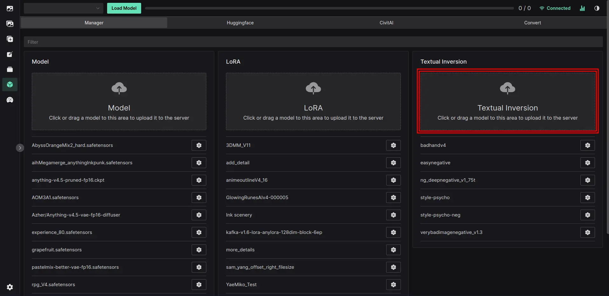
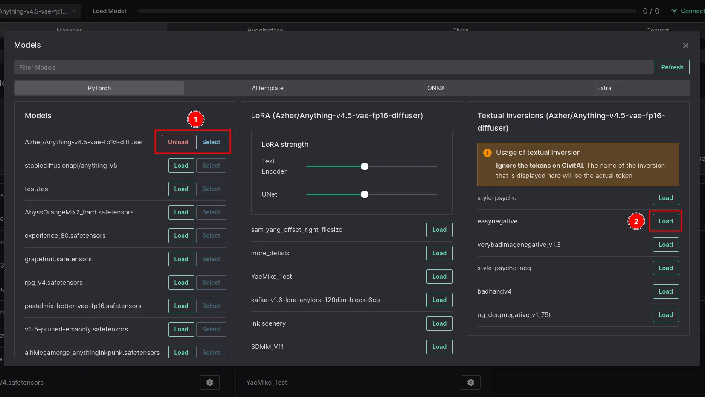
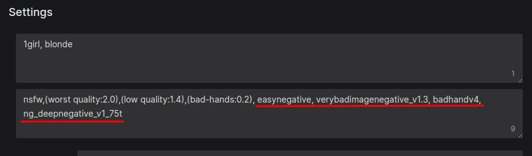

# Textual Inversion

Textual Inversion (Embedding) is a way to define new keywords in a model without modifying the model itself. With this technology, you can inject new objects and styles without training a full model from scratch.

## Downloading

::: tip
We now have CivitAI downloader, head to Models -> CivitAI to download Models, LoRAs and Textual Inversions.
:::

Textual Inversion is available to download from [Civit.ai](https://civit.ai/). You can download them from there and then upload them to Volta via the Model Manager:

## Loading

1. Load any model and click the `Select` button
2. Click `Load` on the Textual Inversion model you want to use

::: tip
You can use multiple Textual Inversion models at once.
:::

::: tip
Textual Inversions can be set to autoload in settings.
:::

## Usage

You can activate the embedding by using the name of the file you loaded. For example, if you loaded `flowers.pt`, you can activate it by using `flowers` in your prompt.

