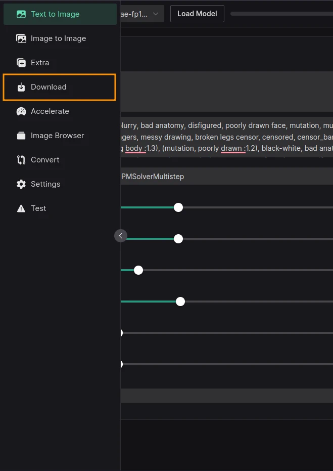
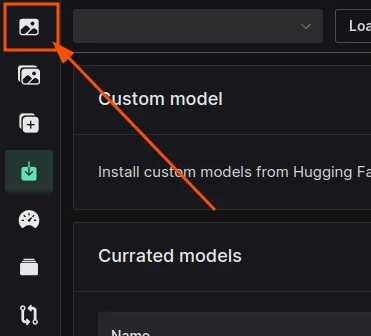
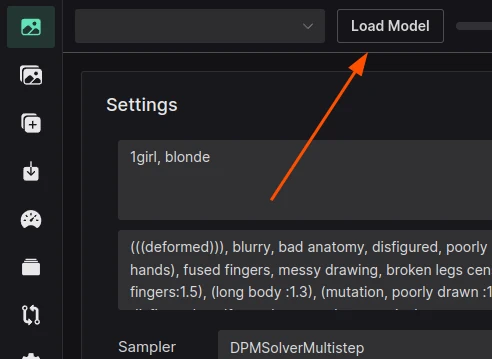

# Guide to creating your first image

This guide assumes that you already have started instance of Volta (fully installed and running)

## Download your first model

Please click the Download button to access the model downloads page:



Next, find a model that you like and click on the download button:


Wait for the download to finish (you can see the progress in the terminal window where you started Volta)

Switch back to the **Text to Image** tab:



## Loading the model

Now that you have downloaded the model, you can load it into Volta.

Click on the **Load Model** button:



Select the model you just downloaded:

1. Click the Load Button (marked as 1)
2. Wait for the button to change to Unload (marked as 2)


Close the modal by clicking on the **X** button in the top right corner.

Check the model selected as active; it should be done automatically:


## Generating an image (Finally!)

Now that you have loaded the model, you can generate an image.

Assuming that you downloaded one of the `Anything` models [anime style] (but not required - these prompts might not be the best on other models but still should work), paste these inputs into the correct fields:

**Prompt**

```
1girl, blonde, night city, hoodie
```

**Negative Prompt**

This is my "silver bullet" for negative prompt - it works on most models and should work on yours as well.

```
(((deformed))), blurry, bad anatomy, disfigured, poorly drawn face, mutation, mutated, (extra_limb), (ugly), (poorly drawn hands), fused fingers, messy drawing, broken legs censor, censored, censor_bar, multiple breasts, (mutated hands and fingers:1.5), (long body :1.3), (mutation, poorly drawn :1.2), black-white, bad anatomy, liquid body, liquidtongue, disfigured, malformed, mutated, anatomical nonsense, text font ui, error, malformed hands, long neck, blurred, lowers, low res, bad anatomy, bad proportions, bad shadow, uncoordinated body, unnatural body, fused breasts, bad breasts, huge breasts, poorly drawn breasts, extra breasts, liquid breasts, heavy breasts, missingbreasts, huge haunch, huge thighs, huge calf, bad hands, fused hand, missing hand, disappearing arms, disappearing thigh, disappearing calf, disappearing legs, fusedears, bad ears, poorly drawn ears, extra ears, liquid ears, heavy ears, missing ears, old photo, low res, black and white, black and white filter, colorless
```

**Sampler**

```
EulerAncestralDiscrete
```

<hr>


Now that you set your inputs, click on the **Generate** button:


Wait for the image to generate. You can see progress on the progress bar or in the terminal window where you started Volta.


