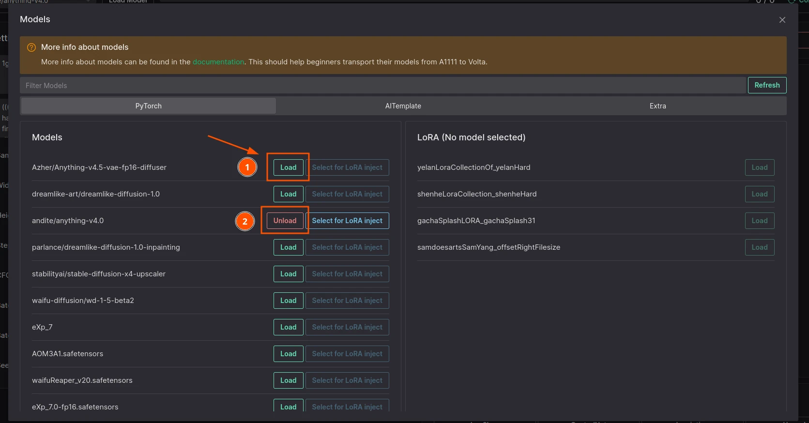
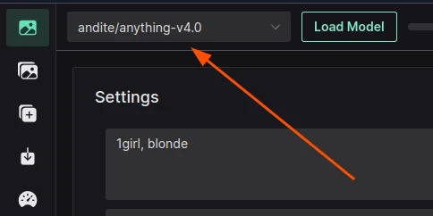
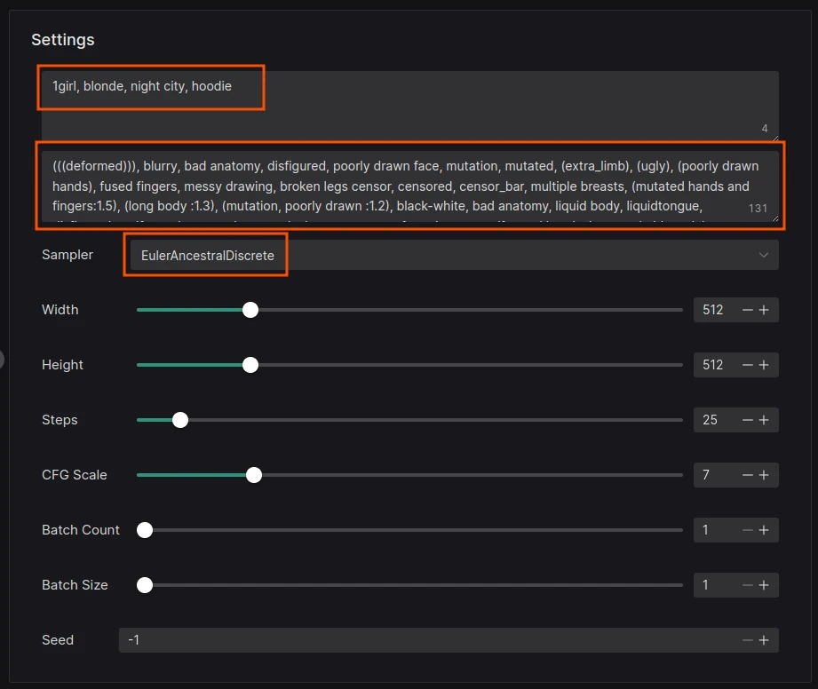

# Guide to creating your first image

This guide assumes that you already have started instance of Volta (fully installed and running)

## Download your first model

Click the Box icon to access the `Models` page:


Find a model that you like and click on it (I will use `Dreamshaper v8` for this example):


Select a version that you want to download (the one automatically selected is usually the best one), select the format and click on the **Download** button:

::: tip Recommendation
Use FP16 models saved in Safetensors format.
:::


Wait for the download to finish (you can see the progress in the terminal window where you started Volta), notification will be displayed when the download is finished

Switch back to the **Text to Image** tab:


## Loading the model

Now that you have downloaded the model, you can load it into Volta.

Click on the **Load Model** button:


Select the model you just downloaded:

1. Click the `Load` Button
2. Wait for the button to change to `Unload`



Close the modal by clicking on the `X` button in the top right corner.

Model should now be loaded and selected:



## Generating an image

### Prompt

```
8k portrait of beautiful cyborg with brown hair, intricate, elegant, highly detailed, majestic, digital photography, art by artgerm and ruan jia and greg rutkowski surreal painting gold butterfly filigree, broken glass, (masterpiece, sidelighting, finely detailed beautiful eyes: 1.2), hdr, (detailed background window to a new dimension, plants and flowers:0.7), <lora:https://civitai.com/api/download/models/87153:0.6>
```

::: tip
You might have noticed the `<lora:https://civitai.com/api/download/models/87153:0.6>` at the end - this is remote LoRA model, find out more about it [here](/basics/lora)
:::

### Negative Prompt

::: tip
You can make your image look a lot better with the use of [textual inversions](/basics/textual-inversion) like [Bad Dream](https://civitai.com/models/72437/baddream-unrealisticdream-negative-embeddings) or [Easy Negative](https://civitai.com/models/7808?modelVersionId=9208)
:::

```
(worst quality, low quality:1.4), nsfw
```

### Sampler

> Pick one of the samplers from the dropdown menu. My favourite is **DPM++ 2S a** and **DPM++ 2M**

### Sigmas

> I will use **Exponential** for this example, but it is a personal preference, experiment with different sigmas to get different results.

<hr>



Now that you set your inputs, click on the **Generate** button. Wait for the image to generate. You can see progress in the UI or in the terminal window where you started Volta.


## Final result


::: info
Image generated in this example has some visual artifacts, but it should provide a good **starting point** for your own experiments with Stable Diffusion and Volta. Learn more by reading other pages in this documentation.
:::
