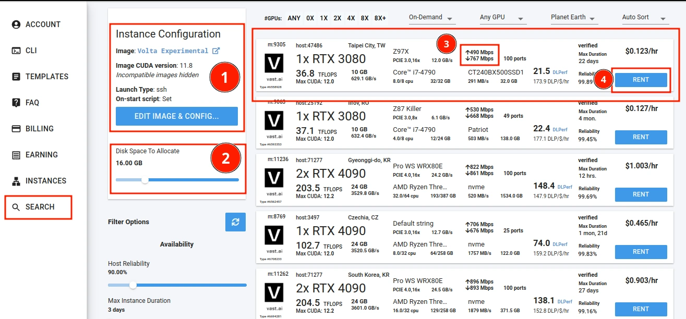
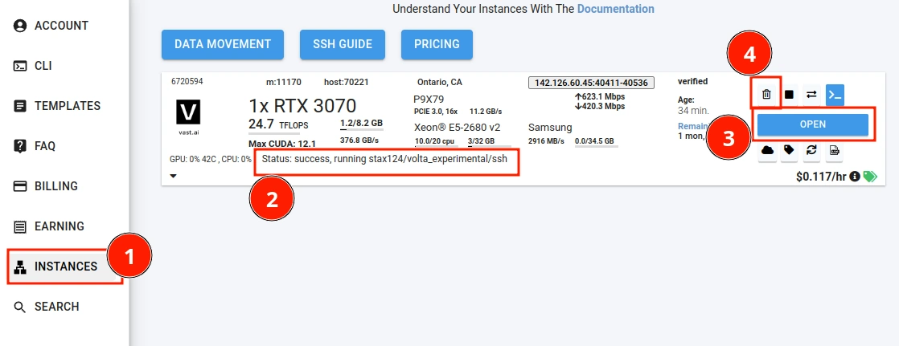

# Vast.ai

::: info
This is a tutorial for using Volta on Vast AI. It is a cloud computing platform that allows you to easily rent GPU instances.
:::

::: info Transparency notice
I get about 2.25% of the money you spend on Vast.ai if you use the link below. We use Vast for testing Volta on other GPUs all the time so I can personally recommend them, but it is only fair that I let you know about that.
:::

Probably the simplest way to get Volta up and running within a few minutes in the cloud.

## Step 1: Create an account

Create an account on [Vast.ai](https://vast.ai/). You will get few cents as credit when you add your card details (good for about half an hour of instance time). I would recommend only using Credit system in case you accidentally leave your instance running for too long.

## Step 2: Create an instance

Click on this ->[link](https://cloud.vast.ai/?ref_id=58604&template_id=49e308f241db18d3656d69f0af75f60d)<- to open a new window that should have Volta pre-selected as the template. I would recommend selecting a server with decent download speed.

## Step 3: Wait for the instance to be ready and connect to it

Once you have created the instance, you should see it on the instances page. Wait for the instance to be ready. This should take about 5 minutes (on a decent internet connection).

Click the `Open` button to connect to the instance. This will open a new tab with Volta (might take about 30s to load properly - just be patient and reload the page if it doesn't load). You can now use Volta as you would on your local machine.

## Step 4: Stop the instance

Once you are done using the instance, click the `Delete` button to get rid of the instance (mark `4` on the image above). This will stop the billing for the instance. You can start the instance again by following the steps above again.

You can technically stop the instance - but you will be billed for the storage - so it is recommended to delete the instance.

## Syncing data between your instances

Vast allows you to connect your cloud buckets to the instance to be used as volumes. This is a great way to sync data between your local machine and the instance. You can find more information about this [here](https://vast.ai/docs/gpu-instances/cloud-sync).

I personally do not use it as I do not care about outputs that I generate for testing but you might find it useful.
