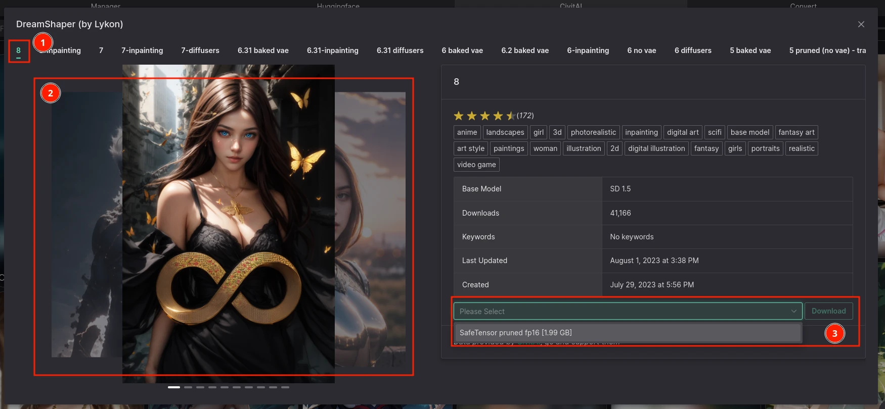

# Model Downloader

## Huggingface

### How to use

Select something from the curated models (will be updated soon) and click the `Download` button.

**OR**

1. Search for the model you want to download on the [HuggingFace model hub](https://huggingface.co/models)
2. Copy the model name (e.g. `andite/anything-v4.0`, not the URL)
3. Paste the model name into the `Model name` input
4. Click `Download` button
5. See the terminal output for progress feedback

## CivitAI

### How to use

1. Click on the `Model` tab
2. Click on the `CivitAI` section
3. Select a model you want to download (optionally, you can filter the models using the dropdowns and filter input)

1. Select the version of the model you want to download
2. Feel free to check out provided images (drag to switch between them)
3. Select correct format and click `Download` button

Model should get downloaded, but might require clicking on Refresh button in the model loader. You can check the terminal output for progress feedback.
