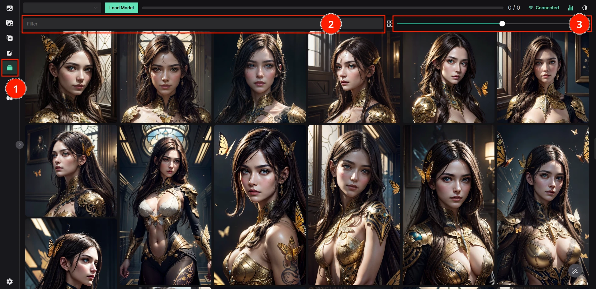

# Image browser

The image browser is a tool to browse and manage images on your system.

## How to use

1. Click on the `Image Browser` tab
2. Optionally, you can filter the images
3. Size of the images can be changed using the slider (can be set permanently in the settings)
